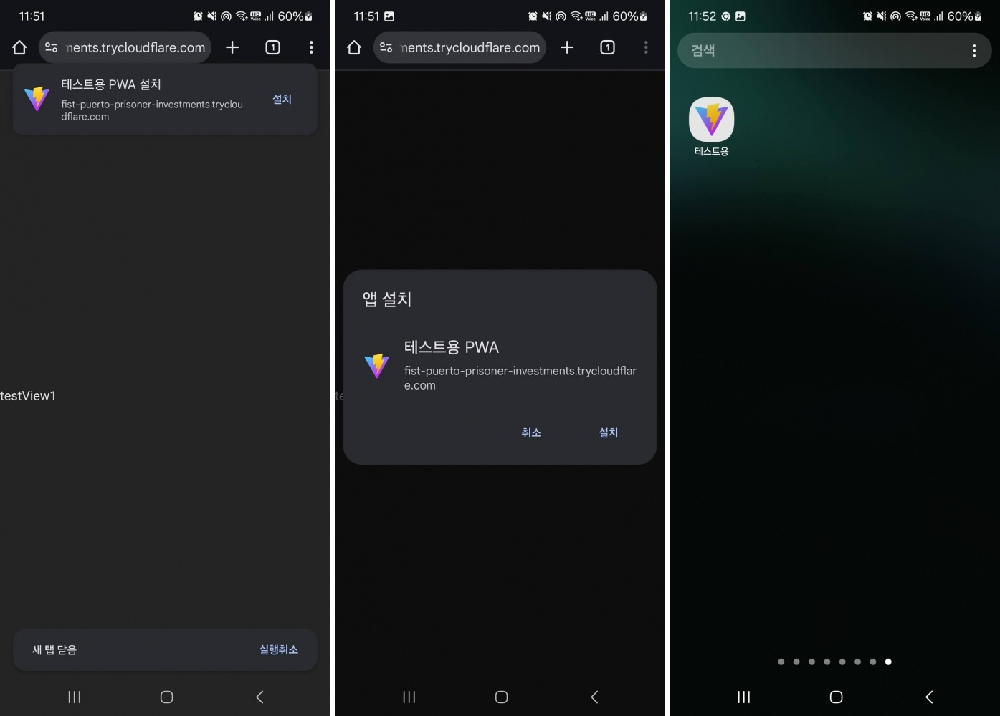

# NVM for Windows 설치 및 Node.js 사용법

## ✅ 설치 전 주의사항

* **Windows**: [공식 릴리즈 페이지](https://github.com/coreybutler/nvm-windows/releases)에서 **가장 최근 릴리즈 버전**을 설치해야 합니다.
* **nvm은 반드시 관리자 권한으로 실행한 CMD 또는 PowerShell**에서 사용해야 정상 작동합니다.
* **Mac**은 관리자 권한이 필요 없습니다. (리눅스는 미확인)
* 환경변수는 자동으로 설정되므로 별도 설정은 필요 없습니다.

---

## 🔧 설치 과정

.png)
.png)

---

## ✅ 설치 확인

```bash
nvm version
```

.png)

---

## 📦 Node.js 설치 및 사용

* 현재 LTS 버전: **22.18.0**
* 반드시 `nvm`을 통해 설치해야 하며

* 

### 🔍 사용할 Node.js LTS 버전 확인

.png)

### 📥 LTS 버전 설치

```bash
nvm install --lts
```

.png)

### 🚀 설치한 버전 사용 설정

```bash
nvm use 22.18.0
node --version
```

.png)

---

## ⚙️ 사용법

먼저 위의 nvm, node를 셋팅한다.
해당 프로젝트를 clone 한다.

1. `npm i`
2. `npm run dev` → 프론트엔드 개발 서버 실행 (모바일 디버깅 기능 추가 필요)
3. `npm run build` → Vite 번들러로 정적 파일로 빌드

---

## 🌍 외부 호스팅

현재 외부 호스팅에는 **Cloudflared**를 사용한다.
(`ngrok`은 유료 아니면 manifest 헤더 설정 불가능한 이슈로 PWA 사용 불가)

### 빠른 실행 명령어

```bash
npx cloudflared tunnel --url http://localhost:5173
```
`강조된 부분이 외부접속 url이다.`
.png)


### 글로벌 설치 방식

```bash
npm i -g cloudflared
cloudflared tunnel --url http://localhost:5173
```

* [Cloudflared npm 페이지](https://www.npmjs.com/package/cloudflared)
* [Cloudflare Tunnel 공식 문서](https://developers.cloudflare.com/cloudflare-one/connections/connect-networks/do-more-with-tunnels/trycloudflare/#use-trycloudflare)

---

## ⚙️ 환경 정보

**vite.config.js** : Vite 자바스크립트 번들러 설정 파일

* **[server](https://ko.vite.dev/config/server-options)**: Vite 프론트 서버와 백엔드 서버 요청 시 CORS 에러 해결을 위한 프록시 테이블 설정
* **[VitePWA](https://vite-plugin-pwa.netlify.app/)**: 프로그레시브 웹앱(PWA, 모바일 앱)으로 만들기 위한 옵션
* **React**: React `.jsx` 파일을 JS로 번들링 하는 플러그인
* **[allowedHosts](https://ko.vite.dev/config/server-options)**: `localhost`를 제외한 모든 호스트는 기본적으로 차단되며, 이 옵션으로 특정 도메인만 허용 가능 (현재 구성은 Cloudflare)
* **[proxy](https://ko.vite.dev/config/server-options#server-proxy)**: 프록시 테이블을 구성하여 다른 서버와 통신 가능

---

## 모바일 앱처럼 사용해보기

 - **cloudflared**를 통해 외부 접근가능한 url을 생성한다.
 - 스마트폰 가서 접속하면 자동으로 설치 팝업이 나오거나, 안나오면 홈화면에 추가를 선택하면 된다.




---

## 🧾 PWA 관련 파일

* **manifest.webmanifest**: PWA에서 사용되는 설정 파일 (앱 이름, 아이콘, 디스플레이 UI 관련 설정 포함)
* **service-worker.js**: PWA의 핵심 구성 요소인 서비스 워커

  * 서비스 워커는 반드시 존재해야 하며, DOM 접근은 불가능
  * 웹 자바스크립트와 메시지 통신은 가능

---
